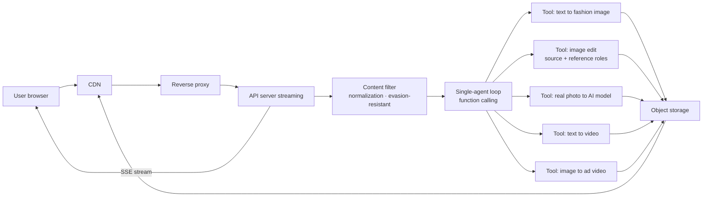

# PopWiz architecture

PopWiz is a single-agent loop with a small, commerce-specialized tool set. This document covers the request lifecycle and three decisions worth explaining.

## System diagram

The diagram intentionally names tools by what they do for the user, not by which third-party API powers them.

## Data flow (one request)

1. **Browser → CDN → reverse proxy → API server.** Connection is HTTPS end-to-end; long-running streaming requests go through the proxy with WebSocket-style keepalives.
2. **Content filter (input side).** The user's message is normalized (Unicode NFKC, zero-width characters stripped, homoglyphs mapped) and scanned against a sensitive-word DFA. The scan runs against both the normalized text and a space-stripped form to defeat insertion-bypass.
3. **Agent turn.** A single LLM call with function calling decides whether to reply directly or to invoke one of the 5 tools. Tools that require an uploaded image are removed from the registry when the session has no images, so the model cannot mis-route.
4. **Tool dispatch.** Credits are deducted atomically with row-level database locking before the third-party API is called. If the tool fails, credits are auto-refunded (cancel-mid-tool does NOT refund — the upstream API was already invoiced).
5. **Result hydration and sanitization.** Internal-only fields and large binary payloads are stripped from the tool result before the model sees it on the next turn — this is the prompt-injection / IP defense layer.
6. **SSE back to browser.** Image and video bytes are uploaded to object storage and served via CDN; the chat receives a streaming event with the asset URL. Periodic heartbeats keep the streaming connection alive through long-running tools.

## Three decisions worth explaining

### Why commerce-vertical tools instead of one general image-gen tool

Generic "make an image" tools force the model to re-derive commerce semantics every call. Splitting into vertical tools (fashion text-to-image, image-edit with source/reference roles, real-photo to AI model, ad-video) lets each wrap a domain-specific prompt pipeline and validation, and lets the agent route by intent rather than by "did the user mention an image".

### Why single-agent, not multi-agent

The task graph is shallow (route → execute → display); multi-agent adds coordination cost without resolving any open problem at our scale. We keep one model picking from a constrained, domain-shaped tool set.

### Why defense-in-depth on prompt injection, not just trusting the model

Vendor safety models drift, are jailbreakable, and don't know what "our IP" is. We need a layer of defenses (system rules forbidding leakage + tool-result sanitization stripping internal fields + content filter applied to both directions) that we own, and that survives any specific model upgrade.