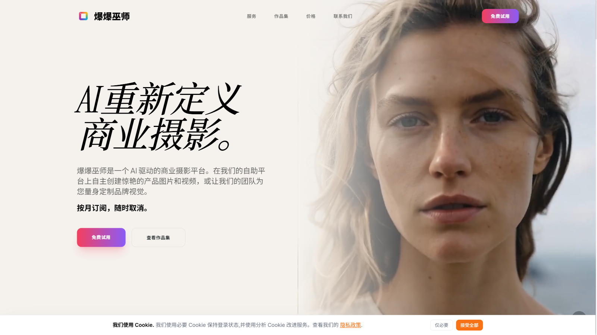

# PopWiz — chat to commerce-grade imagery

> Built at **UCWS Singapore Hackathon 2026** · [Try the live demo](https://popwiz.ai) · <!-- TODO: replace TODO with the recorded video URL -->[90-second walkthrough](TODO)

---

**PopWiz turns a chat message into studio-grade commerce imagery — no Photoshop, no shoot, no model.**

## The problem

Commerce imagery is the single largest production cost for SMB e-commerce sellers. A typical fashion brand pays for a photographer, a model, a stylist, post-retouching, and at least 2–3 iteration rounds per SKU. Existing AI image tools are built for art, not commerce — wrong cropping, wrong lighting, no concept of a product or a hero shot, and no way to iterate on a specific SKU. Brands now need to ship 50+ creatives per launch on a 48-hour cycle, and current options either don't scale to that speed or don't meet the quality bar.

## Live demo

Hosted at [popwiz.ai](https://popwiz.ai). New signups get free credits.

<!-- TODO: replace TODO with the recorded video URL after recording -->
**90-second walkthrough:** [TODO]

The video covers three end-to-end flows (full screenplay in [docs/demo-script.md](docs/demo-script.md)):
1. Commerce hero shot from a text brief
2. Real-photo → AI model
3. Product photo → 5-second ad video

## How it works

Users chat with PopWiz. A single-agent loop with function calling routes intent to one of 5 specialized tools (text → fashion image, image edit with source/reference roles, real-photo → AI model, text → video, image → ad video). Each tool wraps a third-party generation API with commerce-specific prompt engineering, validation, and post-processing (watermarking, thumbnailing, faststart remux for video). Tool calls per conversational turn are bounded by a hard cap, with results streaming back to the chat over SSE.

## Try it in 30 seconds

1. Sign up at [popwiz.ai](https://popwiz.ai) — free credits are granted automatically.
2. Upload a product photo, or describe a scene in the chat (Chinese or English both work).
3. First image arrives in about 60 seconds. Iterate by replying — "change the background", "swap the face", "make it for Singapore market".

## Why it's harder than it looks

*What separates a commerce-grade AI tool from a generic LLM wrapper isn't the model — it's how much of the domain you bake into the prompts, the tool boundaries, and the failure modes the user actually hits.*

| # | Defense | One-line summary |
|---|---------|------------------|
| 1 | **Commerce-vertical prompts and tool wrappers** | The 5 tools aren't generic image gen — each wraps a domain-specific prompt pipeline and validation. Fashion identity replacement runs a structured multi-stage pipeline tuned to preserve scene context and propagate identity coherently across an edited image. Source and reference images receive distinct roles in the request so the model can never confuse "what to edit" with "what to use as reference". Routing examples use real commerce phrasing rather than toy prompts. |
| 2 | **Prompt-injection and IP protection** | System rules forbid the model from revealing its identity, the tool names, or the system prompt. Tool results are sanitized — internal-only fields are stripped and large media payloads are replaced with placeholders telling the model not to repeat them — before the model sees them on the next turn. A successful jailbreak yields nothing repeatable. |
| 3 | **Anti-evasion content filter** | DFA + Unicode NFKC + zero-width character stripping + homoglyph normalization (Cyrillic, fullwidth, leet-style substitutions) + an additional pass against a space-stripped form to defeat insertion-bypass. Applied to BOTH user input and model output, not just one direction. |
| 4 | **Atomic billing with auto-refund** | Row-level database locking prevents concurrent over-spend; dual-pool deduction (subscription credits first, then pack credits); automatic refund if a tool execution fails; per-stream credit cap prevents runaway charges; paired audit-log rows for every charge and refund give a clean reconciliation trail. |
| 5 | **Hallucinated tool-call recovery** | When the model emits a tool call as raw text instead of using the function-call mechanism (a real failure mode at scale), a fallback parser catches known hallucination shapes and dispatches the intended tool — rather than showing raw JSON to the user. |

*All defenses run in production at popwiz.ai. Implementation detail is available to evaluators under NDA against our production repository.*

**Bonus engineering (one-liners):**

- **User-actionable error mapping**: the model's safety and finish signals are decoded into product-team-quality messages (separate paths for safety blocks, recitation, sensitive personal info, and token exhaustion) instead of "AI error, please retry"
- **The user's original phrasing is preserved through tool dispatch** — no LLM translation drift between intent and execution
- **Cancel-mid-tool does NOT refund** — the third-party API has already invoiced us; honesty over user-friendliness
- **ffmpeg faststart remux + auto-poster extraction** so HTML5 `<video>` plays before full download
- **Regex secret-redaction on error logs** (matches common provider API-key patterns) makes accidental key leaks impossible
- **Position-indexed asset hydration with partial-failure tolerance** — one upload 404 doesn't fail the whole turn
- **Session-aware tool gating**: tools requiring an uploaded image are removed from the registry when no images are present (the model literally cannot call them)
- **Tool function signatures as the single source of truth** for the image-required allowlist — no hand-maintained list to drift
- **Periodic SSE heartbeats** during long-running tool execution prevent reverse-proxy idle-connection kills

## Tech stack

| Layer | Choice |
|-------|--------|
| Frontend | Modern React stack (Vite, Tailwind, TypeScript) |
| Backend | Python async API server with streaming responses |
| LLM | Single-agent loop with function calling (commercial model) |
| Generation | Image and video generation APIs (multi-provider) |
| Auth | JWT + OAuth |
| Payments | Subscription + credit packs (PCI-compliant provider) |
| Storage | Object storage + CDN |
| Deploy | Containerized, single-VPS, CDN in front |

*Vendor names are intentionally omitted — the differentiator is the architecture around them. Detail in our private repo, under NDA.*

## Architecture

Full diagram, data-flow narrative, and three architectural decisions worth explaining: [ARCHITECTURE.md](ARCHITECTURE.md).

## Team

<!-- Add additional teammates as `- **Name** — role · [link]` rows. -->
- **Zhiyu Zhang** — Founder & Engineer · [GitHub @kizzhang](https://github.com/kizzhang)

## What's next

Expanding into batch creative pipelines for brand launches and integrations with regional commerce platforms across Southeast Asia. Self-assessment against a generic AI hackathon rubric: [docs/judging-rubric.md](docs/judging-rubric.md).

## Acknowledgments

Thanks to the UCWS Singapore Hackathon 2026 organizers for the event, and to the broader infrastructure and AI ecosystems we build on.

---

© 2026 Conflux Labs Ltd. · [LICENSE](LICENSE)